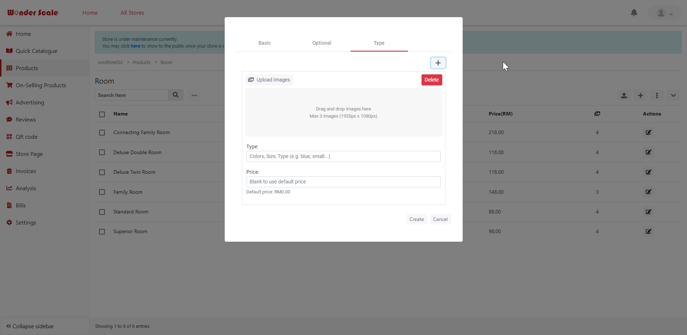

# WonderScaleMerchant
A platform for merchant to manage their online or physical stores.
They can display their products and advertise through the website.
Business can always be managed and monitored in the website. (!)The App requires to function well with server, server is not shared in public.

# Screenshots:
Home Page:
<kbd></kbd>

Login Page:
<kbd></kbd>

Register Page:
<kbd></kbd>

Store List:
<kbd></kbd>

Store Management Home Page:
<kbd></kbd>

Product List:
<kbd></kbd>

Add Product - Basic Details:
<kbd></kbd>

Add Product - Optional Details:
<kbd></kbd>

Add Product - Type Details:
<kbd></kbd>

Upload Multiple Products from template:
<kbd></kbd>

QR Code Provided:
<kbd></kbd>

Store Page Website Configuration:
<kbd></kbd>

Store Page Mobile Configuration:
<kbd></kbd>

Store Page Edit Operating Hour Configuration:
<kbd></kbd>

Invoice Quick Start Page:
<kbd></kbd>

Invoice List:
<kbd></kbd>

Invoice - Item Settings:
<kbd></kbd>

Invoice - Delivery Settings:
<kbd></kbd>

Invoice - Analysis Settings:
<kbd></kbd>

Analysis General:
<kbd></kbd>

Analysis Delivery:
<kbd></kbd>

Analysis Page View:
<kbd></kbd>

Analysis Sales:
<kbd></kbd>

Settings:
<kbd></kbd>

Settings - General:
<kbd></kbd>

Settings - Advanced:
<kbd></kbd>

Settings - Staff:
<kbd></kbd>

# WonderScaleMerchant

This project was generated with [Angular CLI](https://github.com/angular/angular-cli) version 9.0.3.

## Development server

Run `ng serve` for a dev server. Navigate to `http://localhost:4200/`. The app will automatically reload if you change any of the source files.

## Code scaffolding

Run `ng generate component component-name` to generate a new component. You can also use `ng generate directive|pipe|service|class|guard|interface|enum|module`.

## Build

Run `ng build` to build the project. The build artifacts will be stored in the `dist/` directory. Use the `--prod` flag for a production build.

## Running unit tests

Run `ng test` to execute the unit tests via [Karma](https://karma-runner.github.io).

## Running end-to-end tests

Run `ng e2e` to execute the end-to-end tests via [Protractor](http://www.protractortest.org/).

## Further help

To get more help on the Angular CLI use `ng help` or go check out the [Angular CLI README](https://github.com/angular/angular-cli/blob/master/README.md).

## Others

Refer to [UI Design](./UI_Design/) for the frontend development.