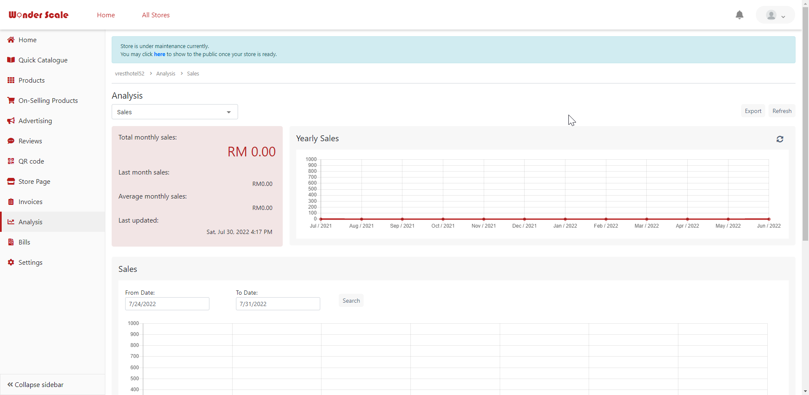

# WonderScaleMerchant
A platform for merchant to manage their online or physical stores.
They can display their products and advertise through the website.
Business can always be managed and monitored in the website.

# Screenshots:
Home Page:

Login Page:

Register Page:

Store List:

Store Management Home Page:

Product List:

Add Product - Basic Details:

Add Product - Optional Details:

Add Product - Type Details:

Upload Multiple Products from template:

QR Code Provided:

Store Page Website Configuration:

Store Page Mobile Configuration:

Store Page Edit Operating Hour Configuration:

Invoice Quick Start Page:

Invoice List:

Invoice - Item Settings:

Invoice - Delivery Settings:

Invoice - Analysis Settings:

Analysis General:

Analysis Delivery:

Analysis Page View:

Analysis Sales:

Settings:

Settings - General:

Settings - Advanced:

Settings - Staff:

# WonderScaleMerchant

This project was generated with [Angular CLI](https://github.com/angular/angular-cli) version 9.0.3.

## Development server

Run `ng serve` for a dev server. Navigate to `http://localhost:4200/`. The app will automatically reload if you change any of the source files.

## Code scaffolding

Run `ng generate component component-name` to generate a new component. You can also use `ng generate directive|pipe|service|class|guard|interface|enum|module`.

## Build

Run `ng build` to build the project. The build artifacts will be stored in the `dist/` directory. Use the `--prod` flag for a production build.

## Running unit tests

Run `ng test` to execute the unit tests via [Karma](https://karma-runner.github.io).

## Running end-to-end tests

Run `ng e2e` to execute the end-to-end tests via [Protractor](http://www.protractortest.org/).

## Further help

To get more help on the Angular CLI use `ng help` or go check out the [Angular CLI README](https://github.com/angular/angular-cli/blob/master/README.md).
